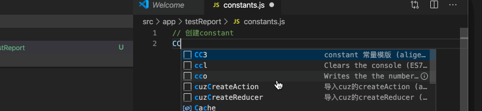
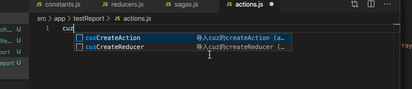
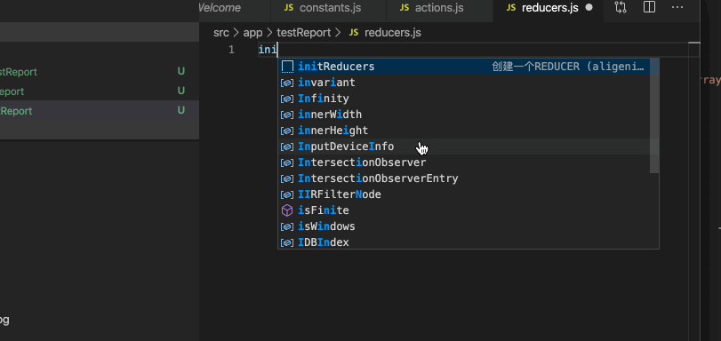
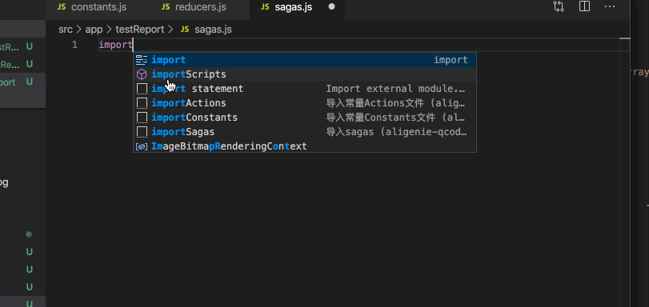

# 分之旅-qcoding 

在某些项目规范上提高代码编写效率，比复制粘贴快点的就是自动生成,合理的使用[tab]按键跳转填空。

#### 编辑Constants变量文件

命令 | 快捷提示 | 说明 | 可选使用
--|--|--|--
CC3|CC3|导入3条Constants模版|是

#### 编辑Actions文件

命令 | 快捷提示 | 说明 | 可选使用
--|--|--|--
cuzCreateAction | cuz | 导入{createAction}|是
CA3|CA3|导入3条Actions模版|是

#### 编辑Reducers

命令 | 快捷提示 | 说明 | 可选使用
--|--|--|--
initReducers | init | 初始化reducers文件模版|是
addReducerFun|add|在reducer内加入一个actions处理|是

#### 编辑Sagas

命令 | 快捷提示 | 说明 | 可选使用
--|--|--|--
importConstants|import|导入constants文件｜是
importActions|import|导入actions文件|是
importSagas|import|导入sagas的基本方法|是
sagaPost|saga|导入saga的post 使用方法|是
sagaGet|saga|导入saga的post 使用方法

# Feature
1. 先人工再智能，后续考虑根据 constants.js 自动生成 actions.js reducer.js 和 sagas.js 初始化文件。
2. 组件的 props & state 模版

# 联系
 - 钉钉 : u1c4my7
 - 邮件 : jiangtao_qepyou@163.com